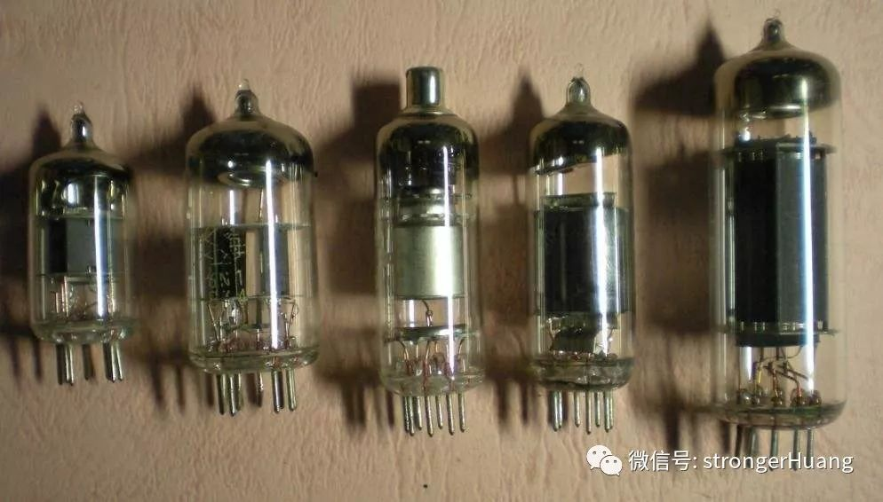

### 

### 软件Bug的来源

Bug，原意为虫子，现在通常指软件缺陷、故障、问题等。

第一代计算机是由许多庞大且昂贵的继电器组成，并利用大量的电力来使继电器工作。可能正是由于计算机运行产生的光和热，引得一只小虫子Bug钻进了一支继电器内，导致整个计算机无法工作。

研究人员费了半天时间，总算发现原因所在，把这只小虫子从继电器中取出后，计算机又恢复正常。后来，Bug这个名词就沿用下来，表示电脑系统或程序中隐藏的错误、缺陷，漏洞或问题。

### 软件Bug的等级
软件bug一般分为四种或五种等级，不同的软件领域，划分的可能略有差异，但大同小异。

一级（致命）Bug

通常表现为：主流程无法跑通，系统无法运行，崩溃或严重资源不足，应用模块无法启动或异常退出，主要功能模块无法使用。

比如：

1.内存泄漏；

2.严重的数值计算错误；

3.系统容易崩溃；

4.功能设计与需求严重不符；

5.系统无法登陆；

6.循坏报错，无法正常退出。

二级（严重）Bug
通常表现为：影响系统功能或操作，主要功能存在严重缺陷，但不会影响到系统稳定性。

比如：
1.功能未实现；
2.功能存在报错；
3.数值轻微的计算错误。

三级（一般）Bug
通常表现为：界面、性能缺陷。

比如：
1.边界条件下错误；
2.容错性不好；
3.大数据下容易无响应；
4.大数据操作时，没有提供进度条。

四级（提示）Bug
通常表现为：易用性及建议性问题
比如：
1.界面颜色搭配不好；
2.文字排列不整齐；
3.出现错别字，但是不影响功能；
4.界面格式不规范。
