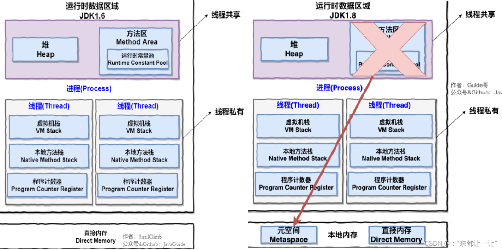

### 1.JVM的区域划分

1. 程序计数器（Program Counter）：线程私有，程序计数器是一块较小的内存区域，它保存着当前线程执行的字节码指令的地址。在线程切换时，程序计数器用于恢复执行的位置。
2. Java 虚拟机栈（Java Virtual Machine Stack）：线程私有，每个线程在运行时都会创建一个对应的虚拟机栈，用于存储方法的局部变量、操作数栈、动态链接、方法出口等信息。虚拟机栈的大小可以通过 -Xss 参数进行调整。
3. 本地方法栈（Native Method Stack）：线程私有，本地方法栈与虚拟机栈类似，但是它为本地方法（Native Method）服务。本地方法是使用其他语言（如 C/C++）编写的方法，通过 JNI（Java Native Interface）与 Java 程序进行交互。
4. Java 堆（Java Heap）：线程共享，Java 堆是 Java 程序运行时创建的对象的存储区域。它是垃圾回收的主要区域，包括新生代和老年代
   - 新生代（Young Generation）：新生代是 Java 堆的一部分，用于存储新创建的对象。新生代通常被划分为 Eden 空间和两个 Survivor 空间（From 和 To）。大部分对象在新生代被创建和销毁。
   - 老年代（Old Generation）：老年代用于存储生命周期较长的对象。经过多次垃圾回收后仍然存活的对象会被转移到老年代。老年代的空间通常较大。
5. 方法区（Method Area）：线程共享，方法区用于存储类的结构信息（如类名、方法名、字段名）、静态变量、常量池等。在 JDK 1.8 中，方法区被移除，取而代之的是元空间（Metaspace）。
6. 元空间（Metaspace）：线程共享，元空间取代了 JDK 1.8 之前的永久代（Permanent Generation）。元空间用于存储类的元数据信息，包括类的结构、方法、字段、常量池等。元空间的大小默认是不受限制的，但受到操作系统的限制。

以上是 java 8 的内存区域划分。需要注意的是，不同版本的 JDK 可能会有细微的差异，特别是在垃圾回收和内存管理方面

### 2.堆的区域划分
在 Java 的堆（Heap）内存中，可以进一步划分为以下几个区域：

1. 新生代（Young Generation）：新生代是堆内存中的一部分，用于存储新创建的对象。新生代可以进一步划分为 Eden 空间和两个 Survivor 空间（通常称为 From 和 To 空间）
   * Eden(伊甸园) 空间：Eden 空间是新对象的初始分配区域。当 Eden 空间满时，触发一次 Minor GC（Young GC）
   * Survivor(幸存者) 空间：Survivor 空间是用于存放在 Minor GC 过程中幸存下来的对象。在每次 Minor GC 后，仍然存活的对象会被复制到 Survivor 空间中的一个空闲区域。而上一次 GC 时的 Survivor 空间则会被清空
2. 老年代（Old Generation）：老年代是存放经过多次 Minor GC 后仍然存活的对象的区域。老年代的对象一般具有较长的生命周期。当老年代空间不足时，会触发一次 Major GC（Full GC）
3. 元数据区（Metaspace）：元数据区是用于存储类的元数据信息，包括类的结构、方法、字段、常量池等。在较新的 JDK 版本中，元数据区取代了传统的永久代（Permanent Generation）。元数据区的大小默认是不受限制的，但受到操作系统的限制
4. 大对象区域（Large Object Space）：大对象区域是专门用于存储较大的对象，避免在新生代和老年代中频繁进行内存拷贝。一般情况下，大对象直接分配在大对象区域

需要注意的是，堆内存的划分可能会因为不同的垃圾回收器（Garbage Collector）策略而有所不同。不同的垃圾回收器在堆内存划分和对象分配上有不同的优化方式。

### 3.java的局部变量、成员变量、静态变量、类、对象等内存是如何分配的
在 Java 中，局部变量、成员变量、静态变量、类和对象的内存分配如下：
1. 局部变量（Local Variables）：局部变量是在方法、构造器或代码块内部定义的变量。它们在方法被调用时创建，并在方法执行结束后销毁。局部变量的内存分配在栈（Stack）上进行，存储在栈帧（Stack Frame）中。
2. 成员变量（Instance Variables）：成员变量是在类中定义的变量，属于类的实例。每个类的实例都有自己的成员变量副本。成员变量的内存分配在堆（Heap）上进行，当创建对象时，会为每个实例分配一块堆内存来存储成员变量。
3. 静态变量（Static Variables）：静态变量是在类中定义的使用 static 修饰的变量，属于类本身而不是类的实例。静态变量的内存分配在方法区（Method Area）中，它们在程序启动时初始化，并在整个程序运行期间存在。
4. 类（Class）：类的定义在方法区中，包括类的结构、字段、方法和字节码等信息。类的信息在程序加载时被加载到方法区中，并在整个程序运行期间存在。
5. 对象（Objects）：对象是类的实例化，每个对象都有自己的一块堆内存空间来存储实例变量。对象的内存分配在堆上进行，当使用关键字 new 创建对象时，会在堆中分配一块连续的内存空间来存储对象的实例变量。

需要注意的是，局部变量和方法参数在方法调用结束后会被销毁，而成员变量和静态变量的生命周期与对象和类的生命周期相关。

### 4.JVM的垃圾回收机制是怎样的
JVM（Java虚拟机）的垃圾回收机制是自动管理和释放内存的一种机制，用于回收不再使用的对象，以提供更多的可用内存空间。

垃圾回收机制的基本原理是通过标记和清除（Mark and Sweep）的过程来确定哪些对象可以被回收。以下是垃圾回收机制的主要步骤：

1. 标记（Marking）：从根对象（如堆栈中的局部变量和静态变量）开始，递归地遍历所有可访问的对象，并将它们标记为“活动”对象。未被标记的对象即为“垃圾”对象。

2. 清除（Sweeping）：在标记完成后，垃圾回收器会扫描整个堆内存，将未被标记的对象释放，并回收它们占用的内存空间。被标记的对象将保留下来，用于后续的内存分配。

3. 压缩（Compacting）：在清除阶段之后，为了提高内存的连续性和空间利用率，一些垃圾回收器还会执行内存压缩操作。压缩过程会将存活的对象紧凑地移动到堆的一端，以便在另一端释放更多的连续内存空间。

垃圾回收机制的具体实现可以有多种算法和策略，如标记-清除算法、复制算法、标记-整理算法等。不同的垃圾回收器（如Serial、Parallel、CMS、G1等）使用不同的算法和策略，以适应不同的应用场景和性能需求。

通过垃圾回收机制，Java程序可以更方便地管理内存，避免显式地进行内存释放操作，减少内存泄漏和内存溢出的风险。

### 5. oracle jdk 1.8.0_321 触发垃圾回收的时机
在 Oracle JDK 1.8.0_321（Java 8 Update 321）中，垃圾回收的时机是由 JVM（Java虚拟机）自动管理的，我们无法直接触发垃圾回收。

JVM 使用了一种称为 "自适应垃圾回收" 的策略来判断何时执行垃圾回收操作。它基于以下几个因素来决定是否触发垃圾回收：

1. 堆内存的使用情况：当堆内存中的对象达到一定的阈值时，JVM 可能会触发垃圾回收来释放不再使用的对象。

2. 内存分配速率：JVM 会监控对象的分配速率。如果分配速率过高，可能导致堆内存快速填满，JVM 可能会触发垃圾回收来释放不再使用的对象。

3. 系统资源：JVM 还会考虑系统的资源情况，如 CPU 使用率和可用内存等。如果系统资源紧张，JVM 可能会触发垃圾回收来释放内存资源。

请注意，以上是一些触发垃圾回收的常见因素，具体的策略可能会因 JVM 的版本和配置而有所不同。此外，我们也可以通过一些参数来调整垃圾回收的行为，例如 `-XX:MaxGCPauseMillis` 参数可以指定最大垃圾回收停顿时间。

总之，在 Oracle JDK 1.8.0_321 中，垃圾回收的时机是由 JVM 自动管理的，基于堆内存使用情况、内存分配速率和系统资源等因素来判断何时执行垃圾回收操作。

### 6.什么场景下会触发新生代的垃圾回收
新生代的垃圾回收是由 JVM（Java虚拟机）自动触发的，通常在以下情况下会触发年轻代的垃圾回收：

1. Minor GC（部分垃圾回收）：当新对象被分配到年轻代时，如果年轻代空间不足，JVM 会触发 Minor GC。Minor GC 主要清理年轻代中不再使用的对象，以释放空间供新对象使用。

2. 对象年龄达到阈值：年轻代中的对象会根据其存活时间进行年龄计数。当对象经过多次 Minor GC 后仍然存活，并且达到一定的年龄阈值时，JVM 会将这些对象晋升到老年代。晋升到老年代的过程也会触发年轻代的垃圾回收。

3. 空间分配担保失败：在进行 Minor GC 时，如果存活对象太多，导致年轻代无法容纳所有存活对象，JVM 可能会进行一次 Full GC（完全垃圾回收）。在 Full GC 之前，为了确保空间分配的安全性，JVM 会先触发一次年轻代的垃圾回收。

请注意，年轻代的垃圾回收是 JVM 内部自动管理的过程，我们无法直接触发或控制。JVM 根据对象的生命周期和内存分配情况来判断何时进行垃圾回收操作。

### 7.什么场景下会触发老年代的垃圾回收
老年代的垃圾回收是由 JVM（Java虚拟机）自动触发的，通常在以下情况下会触发老年代的垃圾回收：

1. Major GC（完全垃圾回收）：当老年代空间不足时，JVM 会触发 Major GC。Major GC 主要清理老年代中不再使用的对象，以释放空间供新对象使用。

2. 晋升担保失败：在进行 Minor GC 时，如果存活对象太多，导致老年代无法容纳所有存活对象，JVM 可能会进行一次 Full GC（完全垃圾回收）。在 Full GC 之前，JVM 会先触发一次老年代的垃圾回收，以尽量减少 Full GC 的频率。

3. 显式调用 System.gc()：尽管不建议显式调用 System.gc() 方法，但在某些情况下，我们可能会手动触发垃圾回收。当调用 System.gc() 方法时，JVM 可能会同时触发年轻代和老年代的垃圾回收。

需要注意的是，老年代的垃圾回收相对较少发生，因为老年代中的对象通常具有较长的生命周期。JVM 会根据对象的存活时间和内存分配情况来判断何时进行垃圾回收操作。

请注意，我们通常不建议频繁地手动触发垃圾回收，因为 JVM 在内部已经有自动的垃圾回收机制来管理内存。频繁的垃圾回收可能会导致性能下降，应该根据具体情况进行调优和配置。

### 8.对象的存活时间
对象的存活时间是指对象从被创建到被垃圾回收之间的时间段。在 Java 中，对象的存活时间可以分为以下几种情况：

1. 瞬时对象（Transient Objects）：瞬时对象是指那些在方法中创建并在方法执行结束后立即被销毁的对象。它们的存活时间非常短暂，仅在方法的生命周期内存在。

2. 局部对象（Local Objects）：局部对象是在方法中定义的对象，它们的作用域仅限于方法内部。当方法执行结束后，局部对象会被销毁，它们的存活时间与方法的执行时间相对应。

3. 成员对象（Member Objects）：成员对象是在类中定义的对象，它们的生命周期与类的实例相关。当类的实例不再被引用时，成员对象会随着实例一起被垃圾回收。

4. 静态对象（Static Objects）：静态对象是在类中定义的 static 修饰的对象，它们的生命周期与类的生命周期相同。静态对象在程序运行期间一直存在，直到程序结束或类被卸载时才会被垃圾回收。

5. 长生命周期对象（Long-lived Objects）：长生命周期对象是指存活时间较长的对象，它们通常分配在老年代。这些对象可能是全局缓存、持久化对象等，它们的存活时间可能会跨越多个方法调用或甚至整个应用程序的生命周期。

需要注意的是，对象的存活时间由 JVM 内部的垃圾回收算法和内存分配策略来决定。JVM 会根据对象的引用关系、内存分配情况以及垃圾回收的算法来判断对象的存活时间，并相应地进行垃圾回收。

### 9.oracle jdk 1.8.0_321 的参数设置
在 Oracle JDK 1.8.0_321 中，有许多参数可以用来调整 JVM（Java虚拟机）的行为。以下是一些常见的参数及其解释，包括一些示例：

1. `-Xmx<size>`：设置最大堆内存大小。`<size>` 是以字节为单位的整数值，或者带有 `g` 或 `G` 后缀的以 GB 为单位的整数值。例如，`-Xmx2g` 表示将最大堆内存设置为 2 GB。

2. `-Xms<size>`：设置初始堆内存大小。`<size>` 的格式和单位与 `-Xmx` 参数相同。例如，`-Xms512m` 表示将初始堆内存设置为 512 MB。

3. `-Xmn<size>`：设置年轻代的大小。`<size>` 的格式和单位与 `-Xmx` 参数相同。例如，`-Xmn256m` 表示将年轻代的大小设置为 256 MB。

4. `-XX:MaxPermSize=<size>`：设置最大永久代（PermGen）大小。`<size>` 的格式和单位与 `-Xmx` 参数相同。例如，`-XX:MaxPermSize=128m` 表示将最大永久代大小设置为 128 MB。

5. `-XX:ParallelGCThreads=<num>`：设置并行垃圾回收的线程数。`<num>` 是一个整数值，表示线程的数量。例如，`-XX:ParallelGCThreads=4` 表示使用 4 个线程进行并行垃圾回收。

6. `-XX:+UseConcMarkSweepGC`：启用并发标记清除（CMS）垃圾回收器。例如，`-XX:+UseConcMarkSweepGC` 表示使用 CMS 垃圾回收器。

7. `-XX:+PrintGCDetails`：在控制台上打印详细的垃圾回收信息。例如，`-XX:+PrintGCDetails` 表示打印详细的垃圾回收信息。

这些只是一小部分常见的参数，还有许多其他参数可以用来调整 JVM 的行为。您可以参考 Oracle JDK 文档中的详细参数列表来了解更多选项和说明。

请注意，不同的 JDK 版本可能会有不同的参数和行为，因此建议在具体应用中根据需求和性能进行适当的调整和配置。
