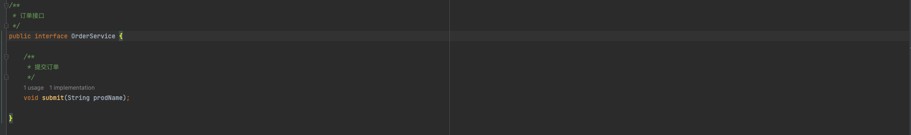
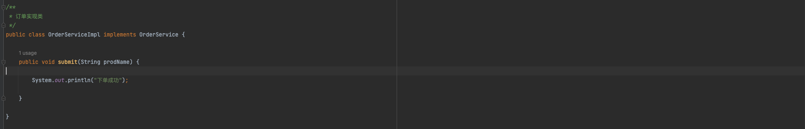
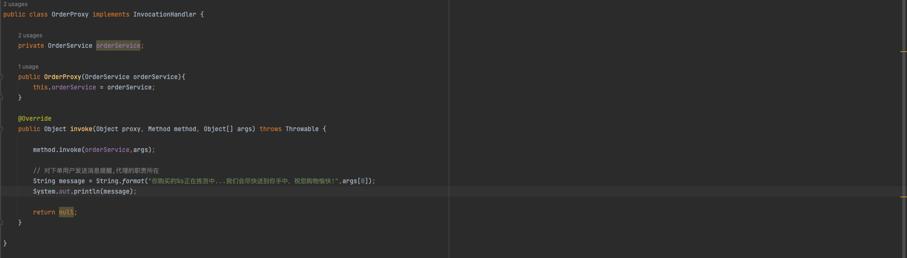
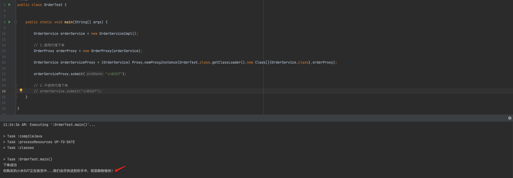

### 1.什么是动态代理？
Java中的动态代理是一种在运行时动态创建代理类和对象的机制。动态代理允许在不修改原有类代码的情况下，通过代理类来扩展或重写原有类的方法，对原有类的功能进行增强。
### 2.为什么会有动态代理？
开放封闭原则：类应该对扩展开放，对修改关闭。
### 3.动态代理使用步骤：
1. 被代理的类：需要实现一个或多个接口
2. 代理类：需要实现InvocationHandler接口，该类负责定义在代理对象上调用方法时的实际行为。
3. 创建代理实例：使用Proxy.newProxyInstance()方法创建代理对象，该方法需要传入三个参数：类加载器、接口数组(被代理的接口类)和InvocationHandler实例（代理类实例）。
4. 使用代理对象：通过代理对象调用方法，实际调用的是InvocationHandler的invoke()方法，可以在这个方法中定义代理逻辑。
### 4.使用案例：
##### 场景
刚刚接手一个陈旧多年的电商项目，需要在下单完成后给用户发送一条消息，提升用户体验。
##### 原订单接口

##### 原订单接口实现类

##### 订单接口代理类

##### 使用代理类下单

