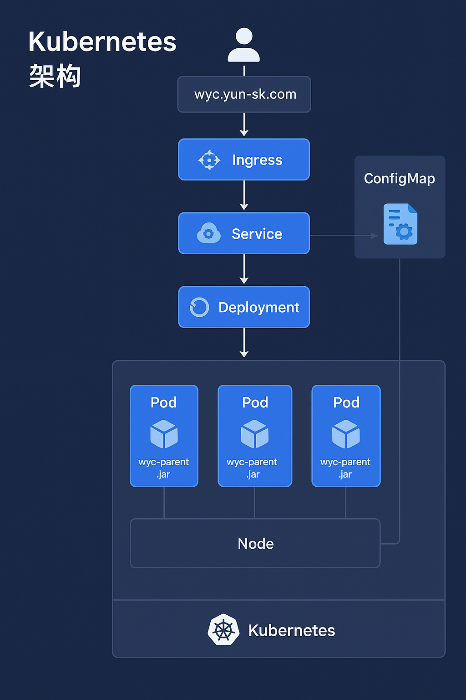

🧩 Kubernetes 核心概念与通俗解释（结合实际项目）
| 概念                     | 英文                 | 核心作用                        | 通俗解释                           | 举例说明（以你的系统为例）                                            |
| ---------------------- | ------------------ | --------------------------- | ------------------------------ | -------------------------------------------------------- |
| **集群**                 | Cluster            | 运行 Kubernetes 的整体环境，由多个节点组成 | 就像一个“工厂”，里面有很多“生产线”（节点）来运行你的应用 | 华为云上部署的 `ylsk-prod` 或 `ylsk-dev-test` 集群                 |
| **节点**                 | Node               | 运行应用容器的主机（物理机或虚拟机）          | 工厂中的一台机器                       | 华为云中的一台云服务器，可能有多核 CPU 和内存                                |
| **命名空间**               | Namespace          | 用于逻辑隔离资源                    | 工厂的不同“生产车间”                    | 你可能有 `dev`（开发）、`test`（测试）、`prod`（生产）三个命名空间               |
| **Pod**                | Pod                | 最小运行单元，封装一个或多个容器            | 工厂中的一个“工作站”                    | 一个 `wyc-parent` Pod 对应运行中的一个 Spring Boot 实例              |
| **容器**                 | Container          | 实际运行应用的环境（Docker 容器）        | 工作站里的“工人”                      | 在一个 Pod 内运行你的 Java 应用镜像                                  |
| **Deployment**         | Deployment         | 控制 Pod 的副本数、版本更新、滚动发布       | 管理“多少个相同工作站”                   | 规定 `wyc-parent` 要始终有 3 个 Pod 在运行                         |
| **ReplicaSet**         | ReplicaSet         | 由 Deployment 管理，负责维持 Pod 数量 | Deployment 的执行者                | 确保即使某个 Pod 挂了，会自动拉起新的                                    |
| **Service**            | Service            | 为一组 Pod 提供统一访问入口            | 工厂前台的“服务窗口”                    | `wyc-parent-service` 将多个 Pod 暴露为统一访问接口                   |
| **Ingress**            | Ingress            | 负责外部流量接入（HTTP/HTTPS）        | 工厂大门口的“门禁系统”                   | `prodgray-ingressnginx-wanip.yun-sk.com` 入口规则，将请求路由到不同服务 |
| **ConfigMap**          | ConfigMap          | 存放非敏感配置信息                   | 配置文件柜                          | 存放如 `application.yaml` 配置信息                              |
| **Secret**             | Secret             | 存放敏感信息（账号、密钥等）              | 加锁的保险箱                         | 存放数据库密码、OBS 秘钥、JWT 密钥                                    |
| **Volume**             | Volume             | Pod 的数据存储卷                  | 硬盘/文件共享盘                       | 存放日志、缓存或上传文件的挂载目录                                        |
| **StatefulSet**        | StatefulSet        | 用于有状态服务（如数据库）               | 有固定编号的“特殊工作站”                  | 运行 Redis、MySQL、Kafka 等需要持久存储的组件                          |
| **DaemonSet**          | DaemonSet          | 保证每个节点上都有一个 Pod             | 每台机器上的“守卫进程”                   | 例如日志采集（如 Fluentd）、监控代理（如 Node Exporter）                  |
| **Job / CronJob**      | Job / CronJob      | 一次性或定时任务                    | 定时器/脚本任务                       | 每晚执行数据库备份、同步任务等                                          |
| **Label / Selector**   | Label / Selector   | 给资源贴标签，用于选择和管理              | 资源的“标签系统”                      | `app=wyc-parent` 标签让 Service 知道该找哪些 Pod                  |
| **Kubelet**            | Kubelet            | 节点上运行的核心代理，负责 Pod 的创建与健康监控  | 工厂现场的“主管”                      | 定期汇报当前节点运行状态                                             |
| **API Server**         | API Server         | 集群的统一入口                     | 工厂管理中心的“前台”                    | 所有 kubectl 命令、KubePi 调用都要经过它                             |
| **Controller Manager** | Controller Manager | 控制各种资源对象的状态                 | 管理调度员                          | 负责让系统“保持在期望状态”                                           |
| **Scheduler**          | Scheduler          | 负责决定 Pod 放在哪个节点运行           | 调度员                            | 选择资源最合适的节点运行新 Pod                                        |
| **etcd**               | etcd               | Kubernetes 的核心数据库           | 工厂档案室                          | 存储所有集群状态数据（如哪些 Pod、在哪运行）                                 |

-----
🧠 一张逻辑图（理解整体关系）
外部访问者
     │
     ▼
 ┌──────────────┐
 │ Ingress (门禁) │ ← 域名: wyc.yun-sk.com
 └──────┬───────┘
        │
        ▼
 ┌──────────────┐
 │ Service (前台)│ ← wyc-parent-service
 └──────┬───────┘
        │
        ▼
 ┌──────────────┐
 │ Pod 集合 (工作站群) │ ← 每个 Pod 内运行 wyc-parent.jar 容器
 └──────┬───────┘
        │
        ▼
 ┌──────────────┐
 │ Node (机器)  │ ← 华为云 ECS 节点
 └──────────────┘
 ----

🔹总结一句话：

Kubernetes 是一个“自动化容器工厂”

Node 是机器

Pod 是车间工作站

Deployment 是生产计划

Service 是前台窗口

Ingress 是门口入口

ConfigMap/Secret 是配置与密码柜

Controller/Scheduler/Kubelet 是自动运维的员工

----- 
