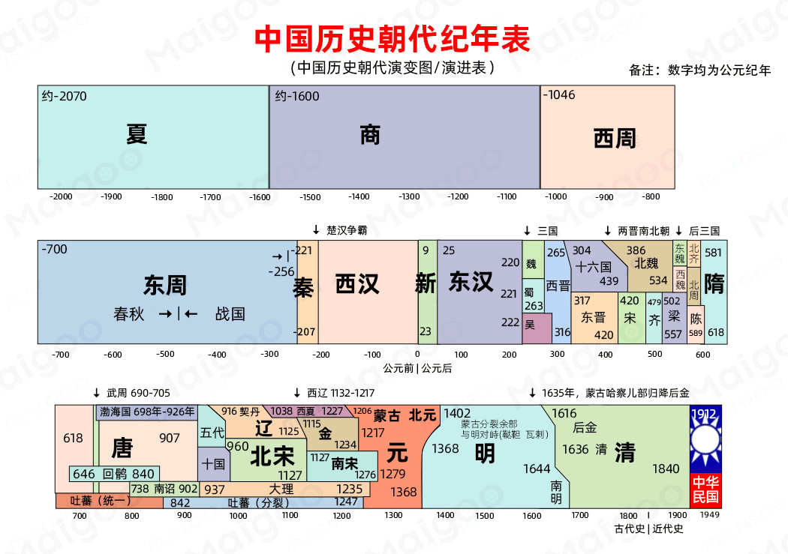

### 中国朝代顺口溜
三皇五帝夏商周，春秋战国乱悠悠。
秦汉三国东西晋，南朝北朝是对头。
隋唐五代又十国，宋元明清帝王休。

### 中国历代皇帝顺序表
秦朝(公元前221 - 207年)
秦始皇嬴政、秦二世胡亥、秦三世子婴。

西汉(公元前202 – 公元8年)
汉高祖刘邦、汉惠帝刘盈、汉文帝刘恒、汉景帝刘启、汉武帝刘彻、汉昭帝刘弗陵、汉宣帝刘淘、汉元帝刘奭、汉成帝刘蔫、汉哀帝刘欣、汉平帝刘行、孺子婴(王莽摄政)。

东汉(25 - 220年)
光武帝刘秀、汉明帝刘庄、汉章帝刘炟、汉和帝刘肇、汉殇帝刘隆、汉安帝刘祜、汉顺帝刘保、汉冲帝刘炳、汉质帝刘赞、汉桓帝刘志、汉灵帝刘宏、汉献帝刘协。

三国(220 - 265年)
魏国: 魏文帝曹丕、魏明帝曹叡、魏齐王曹芳、高贵乡公曹髦、魏元帝曹奂

蜀国: 昭烈帝刘备、后主刘禅

吴国: 武烈帝孙坚、长沙桓王孙策、吴大帝孙权、吴会稽王孙亮、吴景帝孙休、吴乌程侯孙皓晋

西晋(265 - 317年)
晋武帝司马炎、晋惠帝司马衷、晋怀帝司马炽、晋愍帝司马邺。

东晋(317 - 420年)
晋元帝司马睿、晋明帝司马绍、晋成帝司马衍、晋康帝司马岳、晋穆帝司马聘、晋哀帝司马丕、海西公司马奕、简文帝司马昱、孝武帝司马窑、晋安帝司马德宗、晋恭帝司马德文。

北朝(386年 - 581年)
北魏: 道武帝拓跋珪、明元帝拓跋嗣、太武帝拓跋焘、南安王拓跋余、文成帝拓跋浚、献文帝拓跋弘、孝文帝元宏、宣武帝元恪、孝明帝元诩、幼主元钊、孝庄帝元子攸、长广王元晔、节闵帝元恭、安定王元朗、孝武帝元惰

东魏: 孝静帝元善见

西魏: 文帝元宝炬、废帝元钦、恭帝拓跋廓

北齐: 神武帝高欢、文襄帝高澄、文宣帝高洋、废帝高殷、孝昭帝高演、武成帝高湛、后主高纬、安德王高延宗、幼主高恒、范阳王高绍义

北周: 文帝宇文泰、孝闵帝宇文觉、明帝宇文毓、武帝宇文邕、宣帝宇文赞、静帝宇文衍

南朝(420 - 589年)
宋: 宋武帝刘裕、宋少帝刘义符、宋文帝刘义隆、宋孝武帝刘骏、宋前废帝刘子业、宋明帝刘或、宋后废帝刘昱、宋顺帝刘准

齐(萧齐): 齐高帝萧道成、齐武帝萧赜、齐明帝萧鸾、东昏侯萧宝、齐和帝萧宝融

梁(萧梁): 梁武帝萧衍、简文帝萧纲、梁文帝萧绎、梁晋帝萧方智

陈(南陈): 陈武帝陈霸先、陈文帝陈蓓、陈废帝陈伯宗、陈宣宗陈顼、陈后主陈叔宝

隋朝(581 - 618年)
隋文帝杨坚、隋炀帝杨广、隋恭帝杨侑

唐朝(618 - 907年)
唐高祖李渊、唐太宗李世民、唐高宗李治、武后武则天（武瞾)、唐中宗李显、唐睿宗李旦、唐玄宗李隆基、唐肃宗李享、唐代宗李豫、唐德宗李适、唐顺宗李涌、唐宪宗李纯、唐穆宗李恒、唐敬宗李湛、唐文宗李昂、唐武宗李炎、唐宣宗李忱、唐懿宗李准、唐僖宗李儇、唐昭宗李晔、唐哀帝李祝。

北宋(960 - 1127年)
宋太祖赵匡胤、宋太宗赵匡义、宋真宗赵恒、宋仁宗赵祯、宋英宗赵曙、宋神宗赵顼、宋哲宗赵煦、宋徽宗赵佶、宋钦宗赵桓。

南宋(1127 - 1276年)
宋高宗赵构、宋孝宗赵音、宋光宗赵惇、宋宁宗赵扩、宋理宗赵昀、宋度宗赵樭、宋恭帝赵显。

元朝(1260 - 1368年)
元世祖忽必烈、元成宗、元武宗、元仁宗、元英宗、元泰定帝、元天顺帝、元文宗、元明宗、元宁宗、元顺帝。

明朝(1368 - 1644年)
明太祖朱元璋、明惠帝朱允炆、明成祖朱棣、明仁宗朱高炽、明宣宗朱瞻基、明英宗朱祁镇、明代宗朱祁钰、明英宗朱祁镇、明宪宗朱见深、明孝宗朱祐搅、明武宗朱厚娥、明世宗朱厚燎、明穆宗朱载屋、明神宗朱翊钧、明光宗朱常洛、明熹宗朱由校、明思宗朱由检。

清朝(1616 - 1912年)
清太祖努尔哈赤、清太宗皇太极、清世祖顺治福临、清圣祖康熙玄烨、清世宗雍正胤慎、清高宗乾隆弘历、清仁宗嘉庆顒琰、清宣宗道光旻宁、清文宗咸丰奕、清穆宗同治载淳、清德宗光绪载恬、清宣统帝溥仪。