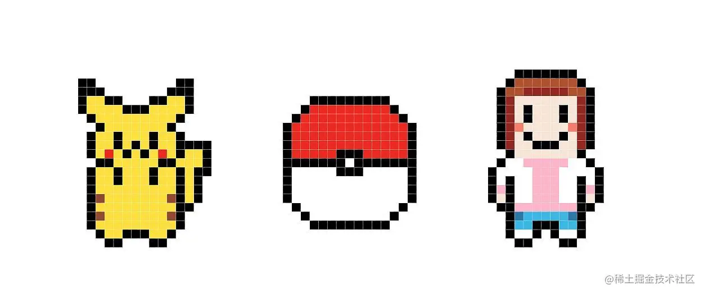
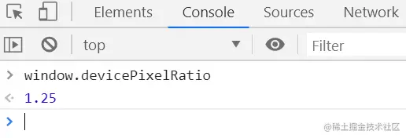
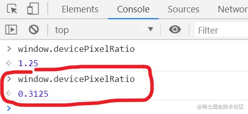

> [原文:https://juejin.cn/post/6844904094344151054](https://juejin.cn/post/6844904094344151054)

## 写在前面

无论是在日常用电脑手机等电子设备，还是做设计、前端开发等工作都需要时刻和像素 / 分辨率打交道，比如在你电脑上运行的占满整个屏幕的项目演示到别人电脑上只显示出一半，别人告诉你说是因为你的电脑屏幕分辨率太大了，你一脸蒙蔽。又比如听别人告诉你说分辨率大小就是你的屏幕大小，你看者你手机上写的分辨率和你电脑上的分辨率一样大小，你看看你小小的手机，再看看你大大的电脑，内心OS：这屏幕能一样大？？？

你去搜专业的维基百科关于分辨率到底是个啥，你又看到一堆专业术语，好吧，你放弃了。。。

那么分辨率到底是个啥，对我们日常生活、工作有什么用处，这里整理总结简单叙述如下。

## 1 关于像素

上面的像素图，我们都很熟悉，可能小时候也做过像素拼豆豆这样的手工。**其实这就是在电脑上构成图片显示出来的原理**，电脑上显示的图像就是由一个个有色彩的小方格拼接起来组成的，那么为什么我们一眼看不出来呢？那是因为电脑上划分的一个个的小方格太小了，很密集，拼接起来就欺骗我们的肉眼看起来就是一条条线画出来的图了。

比如我们正常看到的图片是这样的：

多么可爱的一幅画，看起来就像是我们在纸上画出来的线条画出来的样子，但实际上你放大 n 倍去看，看到的是这样的：

PS：图片是在 PS 中被无限放大的，电脑的图片查看不允许放大这么多倍。

看到了吧，也是和我们常见的像素图是一样的，也是一格格地拼凑起来的，这么小小的一个图片，拼凑成其的小格子有好几万个，所以在我们肉眼看来就成了线条。

上述的一个个的小格子被定义为一个单位，叫做 **像素** ，2像素就是指占据了两个小格子的大小，当然，我们描述一个图片占的小格子数总不能一个个地数小格子吧，图片是矩形，因此常常描述一个图片尺寸时就说多少乘多少像素，像素就是小格子，比如上面的这个图片的尺寸就是 `300 * 300` 像素，也就是说该图片的长、宽都有300个小格子，该图片一共占 `300 * 300 = 90000` 个小格子。

因此小格子就是像素，1像素 就是一个小格子的大小，你若问那 1像素 到底有多大，多少厘米或毫米？ 停，都说了小格子是个矩形，要论大小也得是多少平方厘米或平方毫米，但是小格子的大小就是 1像素，像素是个像厘米或毫米一样的定义好的单位，专门用于电子屏幕上描述图形尺寸的单位，但是像素不像厘米、毫米等长度单位一样有固定的大小，像素是没有固定大小的，奇怪吧，但事实就是这样，只要知道 1像素 就是一个小格子就可以了。

## 2 从像素到分辨率

知道了 像素 ，再来讨论下屏幕尺寸

关于各种设备屏幕的尺寸是以 `英寸` 为单位的，英寸是一个长度单位，是有固定大小的，可以去百度换算下单位成厘米看看有多大。比如我的电脑尺寸是 15.6 英寸，注意各种电子设备的屏幕尺寸指的是屏幕斜对角线的大小，不然你想，屏幕不也是个矩形吗？怎么能用一个长度单位描述呢？应该是 `长度 * 宽度` 描述吧。由于显示屏幕不是胡乱设计比例的，是有固定比例的，如 `16 : 9` 、`4 : 3` 等等，因此屏幕给出斜对角线的大小，具体屏幕矩形的长宽就可以根据屏幕的设计比例计算出来

现在显示屏准备好了，如何将图片显示出来呢？那就将屏幕划分成一个个的小格子，然后在对应位置给小格子上色，全部上完色，图片自然就出来了。

那么屏幕如何划分小格子呢？就像我们画表格一样，横着、竖着加线条，就划分成了一排排的小格子。那么将 `长和宽` 分别划分成多少个小格子呢？这就涉及到了分辨率，分辨率就是用于描述屏幕长度和宽度分别划分成多少个小格子。比如常见的分辨率是 `1920 * 1080` ，实际含义就是屏幕的宽有 1920 个小格子，长有 1080 个小格子，整个屏幕的小格子数就是 `1920 * 1080 = 2073600` 个。足够欺骗我们的肉眼了。

所以分辨率就是指显示屏的长宽均划分成多少个小格子，小格子的单位是像素，因此又称屏幕分辨率为 `1920 * 1080` 像素。分辨率就以像素为单位来衡量了。

分辨率影响了什么？分辨率影响了我们的视觉，若屏幕分辨率很低，如 15.6 英寸的显示屏分辨率为 `100 * 100` 像素，那么一个小格子得占多大，肉眼就看得到小格子的轮廓了，那体验多不好，就像在看像素图一样难受。此时若将上述的图片显示在 `100 * 100` 分辨率的 15.6 英寸的屏幕上，能显示的全吗？上述图片可是占 `300 * 300` 像素的大小的，只能显示 1 / 3的图片。

这也就是说为什么同样的图片在不同分辨率的显示上大小不一样了，因为这个图片占的小格子数是一定的，但是每个设备的像素(小格子)大小不一样，显示的图片大小就不一样。因此 1像素 的具体大小在不同的设备上是不一样的，同样的屏幕尺寸，分辨率越高的，划分的小格子数越多，同一个图片显示出来的大小就越小，但是会越清晰。反之则很大但很模糊。

## 3 图片放大缩小

一般情况下点开图片查看时是将图片的一个小格子对应到一个显示屏幕的小格子。

但图片在被放大或者缩小后，图片的像素小格子便不再是一一对应于显示屏幕的分辨率划分出的物理小格子了，图片放大 3 倍，则一个图片小格子就占据 3 个物理小格子大小显示，因此图片就看起来放大了，甚至超出屏幕大小。

图片缩小到 0.5，则一个图片小格子就占据半个物理小格子，看起来就缩小了。

## 4 物理像素 / 逻辑像素

从上述的图片放大缩小可以看出，图片尺寸所标注的 `300 * 300` 像素大小并不一定时刻等同于设备上的像素大小，放大3倍后就是 `图片的 1像素格子` ===  `设备的 3像素格子`，缩小后又变小了。

因此将上述设备不能改变的、在设备一生产出来后就确定的像素称作 `物理像素` ，也叫 `设备像素(device pixels)`，简称 `dp` 。

与之对应的用于表示图片尺寸、可时刻改变的像素称作 `逻辑像素`，也叫 `设备独立像素(device independent pixels)`，简称 `dip` 。

二者的比值被定义为一个新的概念叫做 `设备像素比(devicePixelRatio)`，简称 `dpr` ，运算公式为 `DPR = 设备像素 / 设备独立像素`。

在一般的电脑上，设备像素是等于逻辑像素的，也就是 `dpr = 1.0` ，但是在高分辨率的电脑上，二者不一定相等，浏览器提供了一个接口可以查看二者的关系。可用 `window.devicePixelRatio` 属性查看，如在我的电脑上获取的结果如下：

**问题**:

那么问题来了，为什么要有物理像素和逻辑像素之分呢？直接用物理像素表示一个图片的大小不行吗？从原则上是可以，但是如果将图片的尺寸用物理像素表示，那么会带来很大的问题，例如，有两台电脑，屏幕尺寸完全一样，一个分辨率是 `1920 * 1080` ，一个是 `960 * 540` ，那么二者同时放一个 `300 * 300` 物理像素大小的图片，那么你会看到什么？

你会看到同一个图片在两台电脑上的大小完全不一样，在高分辨率电脑上图片比低分辨率电脑上的小得多，因为我图片就占 `300 * 300` 个物理格子，高分辨率的电脑物理格子小，占满 `300 * 300` 个也还是小，低分辨率的电脑分的物理格子大，占满 `300 * 300` 个格子就要大。

那就会出现这样一个情况，我们俩电脑尺寸完全一样，看到的同一个图片大小差别那么大，这体验完全不好啊，况且现在无论手机端、还是PC端，厂家生产显示器时都往死里提高分辨率，你会发现你的手机分辨率甚至比电脑还大，那手机看到的图片该得多小啊。

因此，为了使网络资源浏览起来更舒服，也就是让两个屏幕尺寸一样大的设备，呈现的同一个图片看起来差不多是一样大的，因此就发明了 `逻辑像素`，规定所有在电子设备上呈现的图片等资源的尺寸统一用 `逻辑像素` 表示，发明了 `逻辑像素` 后如何实现相同屏幕尺寸但分辨率不同的设备上显示的图片一样大呢？

实现的方法就是降低那些分辨率贼高但是屏幕尺寸很小的设备的 `dpr` ，即 `设备像素比`，从而得到不同的 `逻辑像素` ，例如 `300 * 300  ` 逻辑像素大小的图片，有屏幕尺寸相同的两个设备 A / B，A 的分辨率为 `1920 * 1080`， B 的分辨率是 `960 * 540` ，那么就设置 A 的 `dpr = 0.5 `，从而得到在 A 设备中` 1dip = 2dp`，A 设备中设置 `dpr = 1.0 `，这样同一个图片在 B 设备中一个小格子占一个物理格子，在 A 设备中，因为 A 的物理小格子小，那就占 2 个格子，这样呈现的两个图片大小就看起来是一样大的了。

每个设备在生产时都会规定好逻辑像素比的，上述只是举例，不同设备的具体 `dpr`可以去查，因此可以得出结论：逻辑像素的大小是随设备不同而不同的，与逻辑像素比和物理像素均有关。虽然 `逻辑像素` 的产生基本解决了物理像素产生的问题，但是也并不能绝对保证两个图片在每个相同设备上都一样大，比如两个手机的尺寸不一样，一个小的，一个大的，但是二者的 `dpr` 都是 2.0 ,在分辨率一样的情况下那屏幕尺寸小的肯定显示的图片小些。但基本不会差太多。

## 5 改变逻辑像素比

对于一个设备来说，其物理像素是固定大小的，其逻辑像素比有一个初始值，但是可以改变的，例如网页的缩放、图片的放大缩小都可以改变 `dpr` ，呈现不同的网页、图片大小。如下是我将网页放大后得到的 `dpr` ：

但网页的逻辑像素尺寸还是不变的，只是通过改变 `dpr` 来改变一个逻辑像素占几个物理像素来改变视图大小的。逻辑尺寸和物理尺寸都不变，仅仅通过改变 `dpr` 逻辑像素比来改变视觉大小，是不是很神奇？
