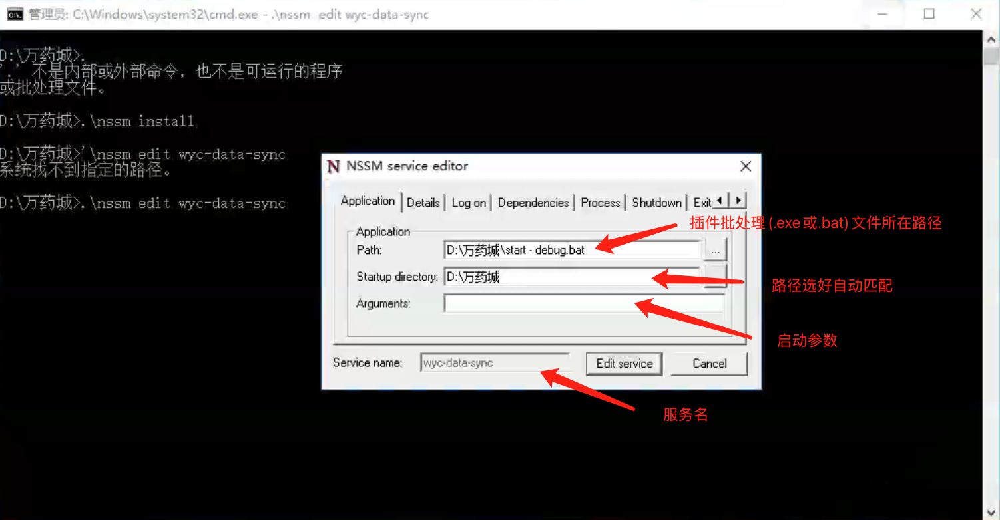

## 背景
公司的核心业务涉及到一个数据同步的场景，数据同步插件安装在客户的服务器上，由于不可控，插件经常掉线，造成线上问题。
## NSSM 介绍
NSSM（Non-Sucking Service Manager）是一个非常实用的Windows服务管理工具。特别适合系统管理员和开发人员使用，可以大大简化Windows服务的管理工作。它的主要特点和功能如下：
1. 核心功能：
- 可以将任何应用程序（包括控制台程序）转换为Windows系统服务
- 具有服务监控和自动重启功能
- 提供图形界面和命令行两种操作方式
2. 主要优势：
- 相比其他服务管理工具（如srvany），NSSM能够更好地处理应用程序崩溃的情况
- 如果服务运行出错，它会自动重启服务
- 会在Windows事件日志中记录详细的运行状态，便于排查问题
3. 常用命令：
~~~bash
nssm install <服务名>    # 安装新服务
nssm edit <服务名>       # 编辑服务
nssm remove <服务名>     # 删除服务
nssm start <服务名>      # 启动服务
nssm stop <服务名>       # 停止服务
nssm restart <服务名>    # 重启服务
nssm status <服务名>     # 查看服务状态
~~~
4. 重要特性：
- 可以设置服务的启动参数、工作目录
- 支持设置服务依赖项
- 可以配置服务运行的用户账户
- 提供进程优先级和CPU亲和性设置
- 支持自定义服务的关闭方式和超时时间
5. 使用方式：
- 无需安装，直接将exe文件放在系统中即可使用
- 建议放在系统PATH环境变量包含的目录中
- 可以通过图形界面或命令行方式管理服务
6. 实用场景
- 将普通应用程序转换为Windows服务
- 需要持续运行且要求高可用性的应用
- 需要自动监控和重启的服务程序
## 实操
1. 下载(https://nssm.cc/download)，注意安装界面的版本和系统要求说明。

2. 将解压出来的nssm.exe文件放入插件所在目录(我的：d:\\万药城)

3. 在插件所在目录的空白处点击右键，选择"在此处打开命令窗口"

4. 输入命令行：.\nssm install ,会弹出安装界面

   

5. 安装好后，系统服务会找得到

   

6. 如果需要更新，执行编辑命令即可：.\nssm edit wyc-data-sync

7. 好了，往后再也不用担心插件掉线了。