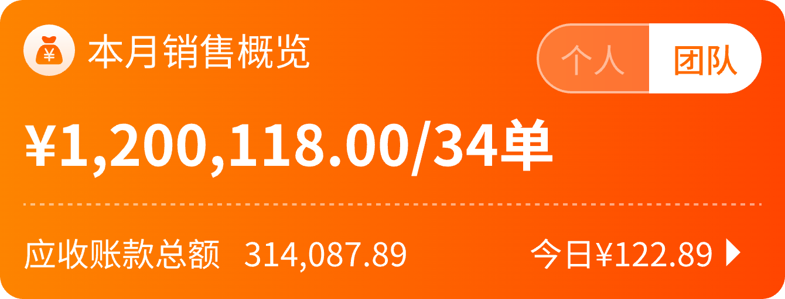

## 一、UI图

## 一、源码
~~~
@Composable
fun HomeManagerSaleTargetView(
    vm: HomeViewModel = viewModel()
) {
    Column(
        verticalArrangement = Arrangement.spacedBy(10.dp),
        modifier = Modifier
            .background(
                brush = Brush.horizontalGradient(
                    colors = listOf(
                        Color(0xFFFF4500),
                        Color(0xFFFD8400)
                    )
                ), RoundedCornerShape(10.dp)
            )
            .padding(10.dp)
            .fillMaxWidth()
    ) {
        Row(
            verticalAlignment = Alignment.CenterVertically,
        ) {
            Row(
                verticalAlignment = Alignment.CenterVertically,
                horizontalArrangement = Arrangement.spacedBy(5.dp),
                modifier = Modifier.weight(1f)
            ) {
                Text(text = "本月销售额", fontSize = 16.sp, color = CustomColors.white)
            }
            Row(
                modifier = Modifier
                    .border(1.dp, CustomColors.white, CircleShape)
                    .clip(CircleShape)
            ) {
                IdentifierType.entries.forEach { type ->
                    val select = vm.saleIdentifier == type
                    //身份类型（1-团队；2-个人）；
                    Text(
                        text = type.name,
                        fontSize = 14.sp,
                        color = if (select) CustomColors.main else CustomColors.white,
                        modifier = Modifier
                            .fantasyClick {
                                vm.saleIdentifier = type
                                vm.getHomeSalesOverview()
                            }
                            .background(if (select) CustomColors.white else Color.Transparent)
                            .padding(10.dp, 5.dp)
                    )
                }

            }
        }
        Row(
            verticalAlignment = Alignment.CenterVertically,
            horizontalArrangement = Arrangement.spacedBy(15.dp),
        ) {
            Text(
                text = vm.saleOverview?.monthSalesAmount ?: "0",
                style = XMFont.f24.boldMedium.white,
                modifier = Modifier.fantasyClick {
                    routeToPage(RouterPath.ComposeWebview) {
                        withString(
                            "url", ProjectConfig.monthSaleUrl(
                                onlySelf = if (vm.saleIdentifier == IdentifierType.个人) 1 else 0
                            )
                        )
                    }
                }
            )
        }
        NDDashLine()
        Row(
            verticalAlignment = Alignment.CenterVertically,
            horizontalArrangement = Arrangement.spacedBy(10.dp),
            modifier = Modifier.fantasyClick {
                routeToPage(RouterPath.ComposeWebview) {
                    withString("url", ProjectConfig.应收账款(responsiblePartyType = vm.saleIdentifier.value))
                }
            }
        ) {
            Text(
                text = "应收账款总额",
                fontSize = 14.sp,
                color = CustomColors.white
            )
            Text(
                text = vm.saleOverview?.receivableAmount ?: "0",
                fontSize = 14.sp,
                color = CustomColors.white
            )
            Spacer(modifier = Modifier.weight(1f))
            Row(
                verticalAlignment = Alignment.CenterVertically,
                horizontalArrangement = Arrangement.spacedBy(5.dp),
                modifier = Modifier.fantasyClick {
                    routeToPage(RouterPath.ComposeWebview) {
                        withString(
                            "url", ProjectConfig.monthSaleUrl(
                                onlySelf = if (vm.saleIdentifier == IdentifierType.个人) 1 else 0,
                                isToday = true
                            )
                        )
                    }
                }
            ) {
                Text(
                    text = "今日销售额¥${vm.saleOverview?.todaySalesAmount ?: 0}",
                    style = XMFont.f14.white
                )
                Icon(
                    id = R.drawable.common_filter_arrow_up,
                    tint = CustomColors.white,
                    modifier = Modifier
                        .rotate(90f)
                        .scale(1.2f)
                )
            }
        }
    }
}
~~~
## 二、解读

### 基本概念
- Column: 垂直排列元素的容器，子元素从上到下排列
- Row: 水平排列元素的容器，子元素从左到右排列

### UI与代码对应分析
从图片看，这是一个销售数据卡片，橙色渐变背景，包含销售额和应收账款信息。

### 整体结构
~~~text
Column (整个卡片)
├── Row 1 (标题行：左边"本月销售额"，右边选择器)
│   ├── Row 1.1 (左侧标题)
│   └── Row 1.2 (右侧身份选择器)
├── Row 2 (销售额数据：左边金额，右边今日数据)
│   └── Row 2.1 (右侧今日数据与箭头)
├── NDDashLine (虚线分隔)
└── Row 3 (应收账款行)
~~~
### 详细解析
1. **最外层Column：**
- 橙色渐变背景
- 内部元素垂直排列
- 包含所有销售数据
2. **第一行(Row)：**
- 左侧文本"本月销售额"
- 右侧身份切换器（个人/团队）
3. **第二行(Row)：**
- 左侧显示销售额金额
- 右侧显示今日销售额(内部是另一个Row，包含文本和箭头图标)
4. **虚线分隔**
5. **第三行(Row)：**
- 应收账款信息
### 嵌套关系实例
以第一行为例：
~~~kotlin
Row(verticalAlignment = Alignment.CenterVertically) {
    Row(
        // 左侧"本月销售额"
        modifier = Modifier.weight(1f)
    ) {
        Text(text = "本月销售额")
    }
    Row(
        // 右侧身份选择器
    ) {
        IdentifierType.entries.forEach { type ->
            Text(text = type.name)
        }
    }
}
~~~
这里Row里面嵌套Row的目的是：
- 外层Row确保左右两部分的布局关系(左侧标题、右侧选择器)
- 内层Row分别处理各自区域的布局细节
- weight(1f)使左侧占据所有剩余空间
从UI看：外层Row水平分为两部分，右侧内层Row再水平排列"个人"和"团队"两个选项。
