[原文链接](https://developer.aliyun.com/article/1414211?utm_content=g_1000387820)
**简介：** 作为一个开发，日常工作中免不了要画一些图，无论是技术架构图还是业务流程图。基于个人的一些经验，作者分享了他的作图方法，给大家一点思路提供参考，希望在未来的工作、生活中都能有所帮助。

来源｜阿里云开发者公众号

作者｜湘叶

# 前言

今天的分享不是干货，是锦上添花的软技能。作为一个开发，日常工作中免不了要画一些图，无论是技术架构图还是业务流程图。基于个人的一些经验，分享一下我的作图方法，给大家一点思路提供参考，希望在未来的工作、生活中都能有所帮助。

# 一. 图例

**1. 代码实现图**

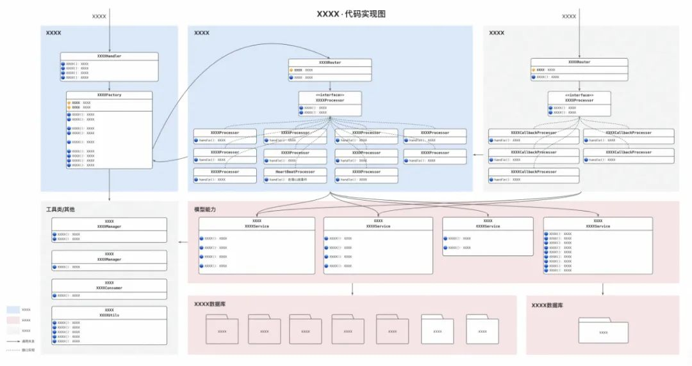

**2. 技术架构图**

### 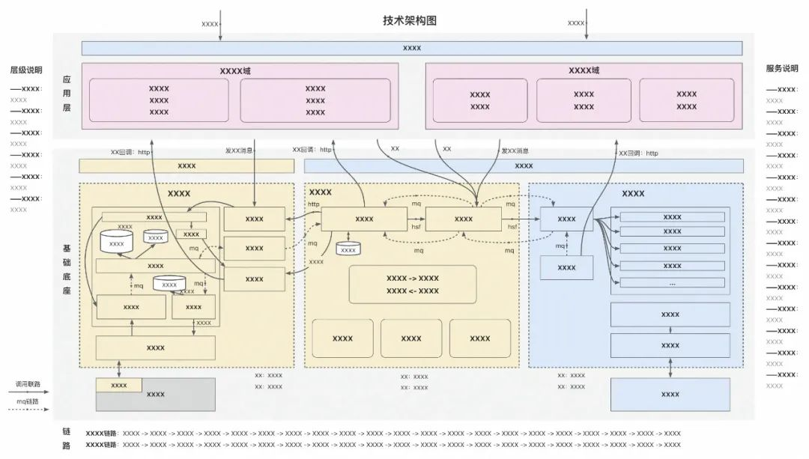

**3. 业务流程图**

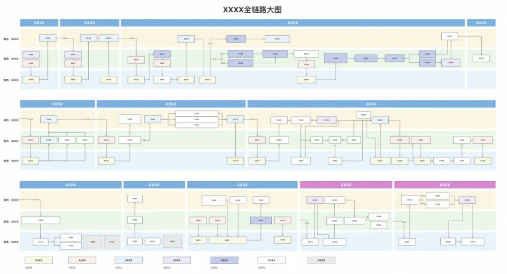

**4. 技术链路图**

### 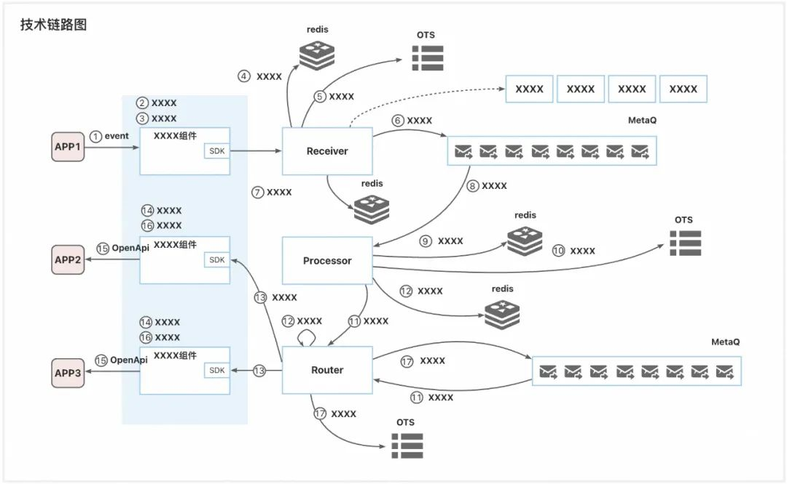

**5. 交互时序图**

### 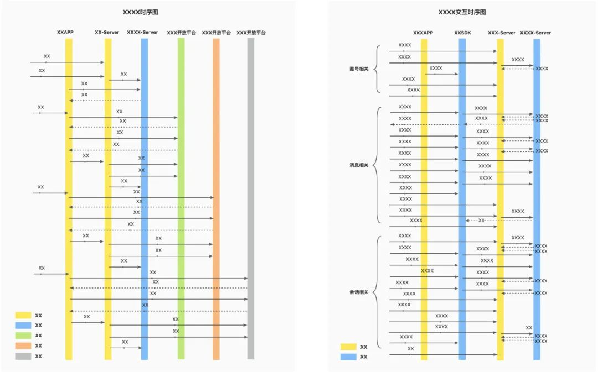 



> Tips：以上图例均用语雀画板创作

# 二. 好图的定义

- 结构清晰：观点明确、主次分明、内容清楚
- 外表美观：有更多的浏览欲/阅读欲
- 内容完整：一张图内容自闭环

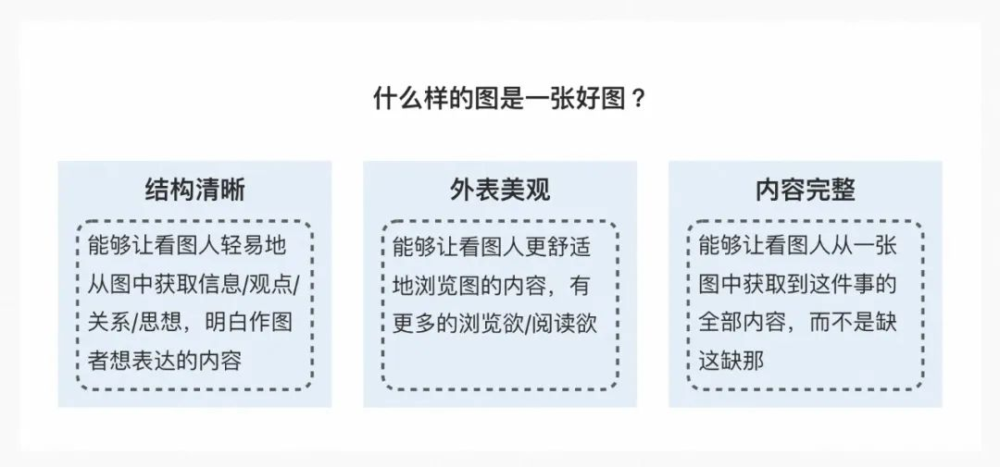

# 三. 关键点

如何让图结构更清晰？具有设计感，设计四大原则。如何让图外表更美观？具有美感，色轮的运用、黄金分割。如何让图内容更完整？以终为始的设计，用户为先的思想，信息补全/添加标注。

**1. 设计感：设计四大原则**

###  

- 亲密性：实现组织性（让有关系的元素挨在一起，有区别的元素分开）
- 对齐：使页面统一而且有条理（元素与元素之间存在一些对齐效果）
- 对比：增强页面的效果、有助于信息的组织（元素与元素之间存在一些对比效果）
- 重复：更统一，增强视觉效果（让类似的元素存在一样的效果/样式）

将这些原则应用到图的线、块、面上。

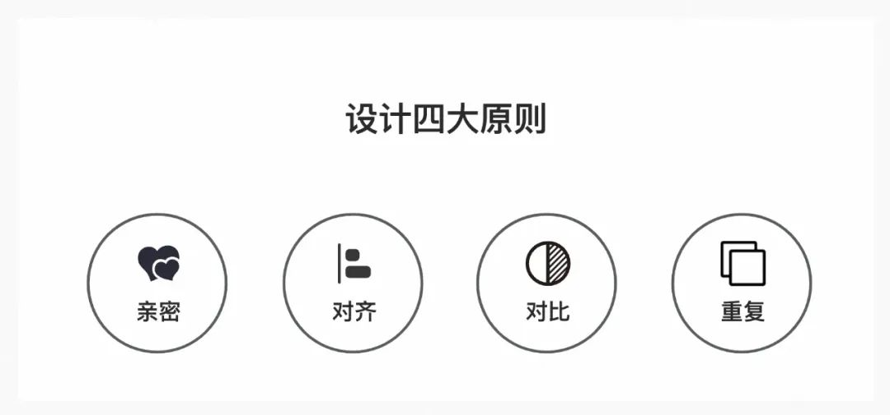

> **Tips：**世界著名设计师罗宾·威廉姆出版过一本畅销书，叫做《写给大家看的设计书》，里面提到了设计四大原则：亲密性、对齐、对比、重复，四大基本原则涵盖了品牌、电商、包装、UI等诸多领域，成为众多设计从业者必须掌握的设计原则。对于非设计的同学，也应该了解一下，提升自己的设计感。

**2. 美感：色轮的运用**

###  

- 美术三原色：红黄蓝（在三色场景下，应用最多最广泛的颜色）
- 互补色：一种作为主色，另一种作为强调（在二色场景下，用互补色）
- 等距三色组：会让人愉悦的颜色组合（在三色场景下，使用等距三色组具有愉悦感）
- 采用同层级的颜色：具有和谐感的颜色组合（在多色场景下，采用同层级的颜色更具和谐）

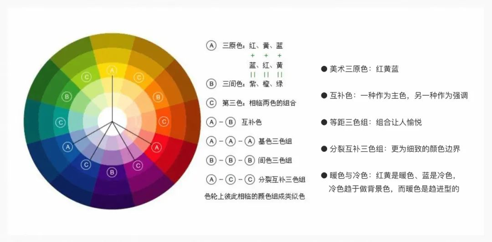

> Tips：《写给大家看的设计书》里面提到了对颜色的运用，我们要从色轮上找到颜色的运用方法

**3. 美感：黄金分割构图法**

###  

- **黄金分割：**0.618（图的整体大小采用长1.618宽1的黄金比）
- **斐波那契数列：**1，1，2，3，5，8，13，21，34，55，89……，当趋向于无穷大时，前一项与后一项的比值越来越逼近黄金分割0.618

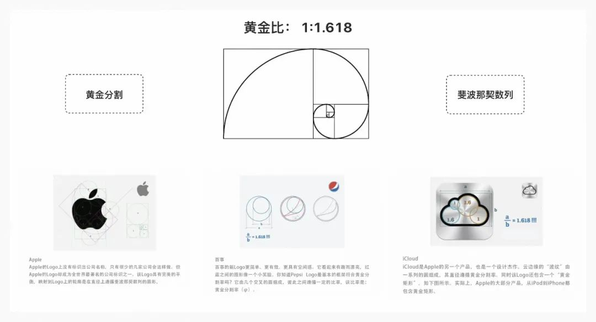

> **Tips：**黄金分割是指将整体一分为二，较大部分与整体部分的比值等于较小部分与较大部分的比值，其比值约为0.618。黄金比有严格的艺术感、和谐感，蕴藏丰富的美学价值，而且呈现于不少动物和植物的外观。现今普遍很多工业产品、电子产品、建筑物或艺术品均应用了黄金比，使其更美观。

**4. 完整感：以终为始的设计**

###  

- **思考先行：**以终为始的设计
- **列出所有要素：**所有能帮助看图人理解的元素都要有，包括图例标注、箭头顺序、标题、注解
- **用户为先：**把自己当作看图人，在没有上下文的情况下能获取到图中多少信息

在这里我们要借鉴以终为始的思维模式，在作图前我们要想清楚作这张图的目的是什么，是想要表达清楚什么，以及需要哪些元素，最终实现的效果就是通过一张图，就能完整地了解你的意图和目标。

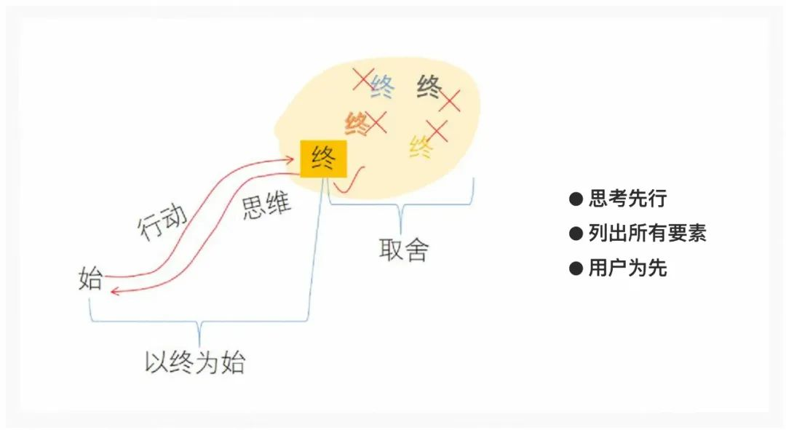

> **Tips：**史蒂芬·柯维的《高效能人士的七个习惯》中，“以终为始”，是第二个好习惯。“以终为始”是以所有事物都经过两次创造的原则为基础的。所有事物都有心智的，即第一次的创造(mental /first creation)，和实际的，即第二次的创造(physical/second creation)。我们做任何事都是先在心中构思，然后付诸实现。正因如此，认定使命才显得如此重要。

# 四. 结语

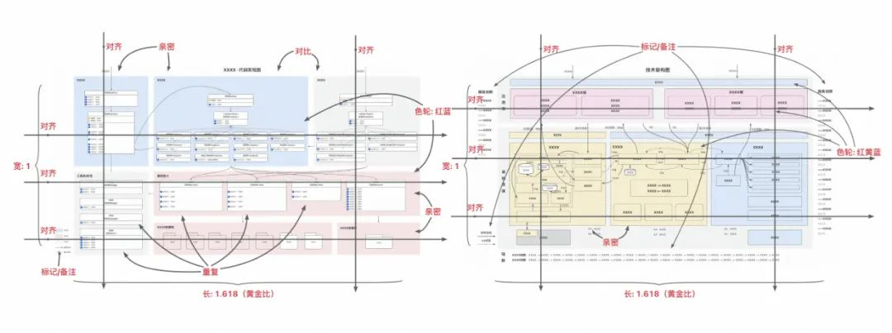

了解了这4个关键点，再回头看看第一部分的图例，是不是有更好的体感了。最后，4个关键点只是提升你的作图思维，具体XX架构图/XX业务图/XX流程图/XX链路图/XX时序图应该怎么画，每个人实操画出来的风格都不一样，就像有的人喜欢黑字白底、有的人喜欢白字黑底、有的人喜欢深色、有的人喜欢浅色等等，但只要遵循**亲齐比复四大原则、色轮的运用、黄金分割构图法、以终为始的设计**这4个关键点，画出来的图就不会太差，快来试试吧～