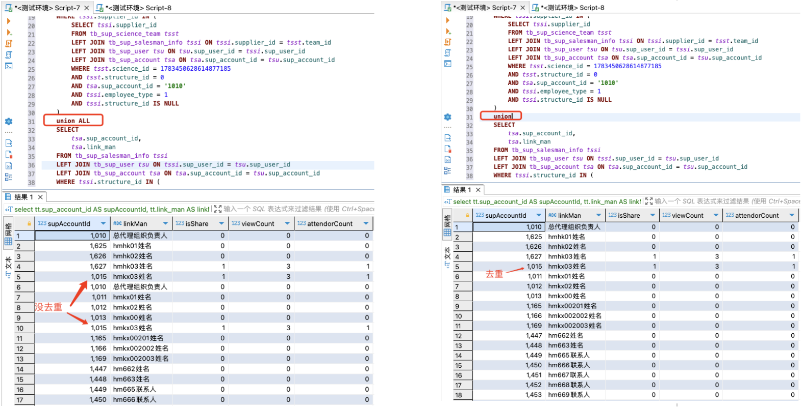

> 代码标准：简洁、易读、易扩展
#### 1.填充客户列表「是否已经添加计划」标签
~~~java
private void loadAddPlanLabel(List<VisitCustInfo> resultList, Long supUserId, String planTime) {
    List<String> custIds = resultList.stream().map(VisitCustInfo::getCustId).collect(Collectors.toList());
    Map<String,VisitCustInfo> map = resultList.stream()
            .collect(Collectors.toMap(VisitCustInfo::getCustId,item -> item));
    List<String> addPlanCustIds = custVisitMapper.findVistPlan(custIds,supUserId,planTime);
    if (!CollectionUtils.isEmpty(addPlanCustIds)) {
      addPlanCustIds.stream().forEach(custId -> {
        map.get(custId).setAddDayPlan(true);
      });
    }
  }
~~~
####  2.填充客户列表「当月已拜访次数」标签
~~~java
private void loadVisitCountLabel(List<VisitCustInfo> resultList, Long supUserId) {
    List<String> custIds = resultList.stream().map(VisitCustInfo::getCustId).collect(Collectors.toList());
    Map<String,VisitCustInfo> map = resultList.stream()
            .collect(Collectors.toMap(VisitCustInfo::getCustId,item -> item));
    List<VisitCustInfo> visitedCustList = custVisitMapper.findVistCount(custIds,supUserId);
    if (!CollectionUtils.isEmpty(visitedCustList)){
      visitedCustList.stream().forEach(visitCustInfo -> {
        map.get(visitCustInfo.getCustId()).setVisitCountCurMonth(visitCustInfo.getVisitCountCurMonth());
      });
    }
  }
~~~
### 3.批量更新Update Select.....
~~~myslq
UPDATE tb_cust_main tcm
JOIN (
    SELECT tcm.cust_id, tec.link_man AS erplinkman, tec.link_phone AS erplinkphone
    FROM tb_cust_main tcm 
    INNER JOIN tb_cust_relation tcr ON tcm.cust_id = tcr.cust_id 
    INNER JOIN tb_erp_cust tec ON tcr.store_cust_no = tec.erp_cust_no 
    WHERE tcr.store_id = 1735134917792903169 
    AND tcm.legal_person_tel LIKE 'Ylsk%' 
    AND tec.link_phone NOT LIKE 'Ylsk%'
) erpcust ON tcm.cust_id = erpcust.cust_id
SET tcm.legal_person = erpcust.erplinkman, tcm.legal_person_tel = erpcust.erplinkphone;
~~~
### 4.对集合做统计分析
~~~java
// 管理者身份下的团队或部门下的业务员分享明细
List<ScienceShareUserVo> shareUserList = shareMapper.findShareUserList4Manager(scienceId,scienceQo.getSupAccountId());
// 统计分享用户数
Long shareUserCount = shareUserList.stream().filter(item -> item.getIsShare() == 1).collect(Collectors.counting());
// 统计查看客户数
int viewCount = shareUserList.stream().mapToInt(item -> item.getViewCount().equals("-") ? 0 : Integer.valueOf(item.getViewCount())).sum();
// 统计报名客户数
int attendorCount = shareUserList.stream().mapToInt(item -> item.getAttendorCount().equals("-") ? 0 : Integer.valueOf(item.getAttendorCount())).sum();
~~~
### 5.mysql UNION 和 UNION ALL 的区别
UNION:相同的行去重
UNION ALL ：相同的行不去重，由于没有去重的计算，性能优于UNION

### 6.insert into select .....
~~~mysql
insert into tb_sup_report_merssage (prod_no,sup_user_id,message_type,message_content,supplier_id,batch_number)
        SELECT
            tsres.store_prod_no,
            tssi.sup_user_id,
            10,
            concat(tsres.prod_name,'等商品即将过期，请马上处理')  ,
            tsres.supplier_id,
            tsres.batch_number
        FROM
            tb_sup_report_expiration_soon tsres
                JOIN
            tb_sup_salesman_info tssi
            ON tssi.supplier_id = tsres.supplier_id
                AND tssi.employee_type = 1
                and tsres.create_at > DATE_ADD(CURDATE(), INTERVAL -7 day)
        WHERE
            NOT EXISTS (
                    SELECT 1
                    FROM tb_sup_report_merssage tsrm
                    WHERE
                        tsrm.sup_user_id = tssi.sup_user_id
                      AND tsrm.prod_no = tsres.store_prod_no
                      AND tsrm.batch_number = tsres.batch_number
                      and tsrm.message_type = 10
                )
~~~

### 7.insert into  on duplicate key updat.....
~~~mysql
<insert id="batchSaveOrUpdate">
    insert into tb_sup_report_expiration_soon (
      store_prod_no,
      prod_name,
      prod_specification,
      bigpackage_quantity,
      store_no,
      owner_id,
      supplier_id,
      erp_no,
      batch_number,
      production_date,
      validtime,
      `storage`
    )
    values
    <foreach collection="list" item="item" index="index" separator=",">
      (
        #{item.storeProdNo},
        #{item.prodName},
        #{item.prodSpecification},
        #{item.bigpackageQuantity},
        #{item.storeNo},
        #{item.ownerId},
        #{item.supplierId},
        #{item.erpNo},
        #{item.batchNumber},
        #{item.productionDate},
        #{item.validtime},
        #{item.storage}
      )
    </foreach>
    on duplicate key update
      bigpackage_quantity = values(bigpackage_quantity),
      storage = values(storage)
    </insert>
~~~
### 8.找出两个对象集合中的差异部分
第一步：先重写对象的equals方法(默认情况下，equals 方法会比较对象的内存地址，即只有当两个对象的引用相同时才会返回 true。如果是用到lombok插件的Data注解，则默认会根据对象的成员变量值重写equals)
~~~java
public class TargetUserQo {
    String supUserId;
    String linkMan;

    List<String> data;

    @Override
    public boolean equals(Object o) {
        if (this == o) return true;
        if (o == null || getClass() != o.getClass()) return false;
        TargetUserQo that = (TargetUserQo) o;
        return Objects.equals(supUserId, that.supUserId) &&
                Objects.equals(linkMan, that.linkMan);
    }

    @Override
    public int hashCode() {
        return Objects.hash(supUserId, linkMan);
    }
}
~~~
第二步：利用stream()求差异
~~~java
// 1.导入的用户列表
List<TargetUserQo> importUsers = targetUserImportQo.getUserList();

// 2.有效的用户列表
List<TargetUserQo> validUsers = targetService.importCheck(targetUserImportQo);

// 3.无效的用户列表，即importUsers 和 validUsers 的差异
List<TargetUserQo> invalidUsers = importUsers.stream()
        .filter(user -> !validUsers.contains(user))
        .collect(Collectors.toList());
~~~
### 9.一对多关系表，统计分析
以“一”表的维度查询，对“多”表的数据做统计
~~~sql
SELECT
             tssi.sup_user_id, -- 授信业务员id
             tsa.link_man, -- 授信业务员名称
             tsbb.supplier_name, -- 所属团队
             tssi.credit_status,-- 授信状态
             COUNT(tscc.cust_id) AS creditCustCount, -- 授信客户数
             ifnull(SUM(tscbr.accounting_amount),0) AS creditBillAmountTotal, -- 授信订单金额
             count(distinct(CASE WHEN tscbr.accounting_status = 1 THEN tscbr.cust_id END)) as repaymentingCustCount, -- 待回款客户数
             IFNULL(SUM(CASE WHEN tscbr.accounting_status = 1 THEN tscbr.accounting_amount END), 0) AS repaymentingAmountTotal, -- 待回款订单金额
             count(distinct(CASE WHEN tscbr.accounting_status = 1 and tscbr.plan_repayment_time <   CURDATE() THEN tscbr.cust_id END)) as expireCustCount,-- 逾期客户数
             IFNULL(SUM(CASE WHEN tscbr.accounting_status = 1 and tscbr.plan_repayment_time < CURDATE() THEN tscbr.accounting_amount END), 0) AS expireAmountTotal -- 逾期订单金额
         FROM
             tb_sup_salesman_info tssi
                 LEFT JOIN
             tb_sup_user tsu ON tsu.sup_user_id = tssi.sup_user_id
                 LEFT JOIN
             tb_sup_account tsa ON tsa.sup_account_id = tsu.sup_account_id
                 LEFT JOIN
             tb_sup_b2b tsbb ON tssi.supplier_id = tsbb.supplier_id
                 LEFT JOIN
             tb_sup_credit_config tscc ON tscc.sup_user_id = tssi.sup_user_id AND tscc.responsible_party_type = 1
                 LEFT JOIN
             tb_sup_credit_bill_record tscbr ON tscbr.sup_user_id = tssi.sup_user_id and tscc.cust_id = tscbr.cust_id AND tscbr.responsible_party_type = 1
         WHERE
            tssi.is_credited = 1
            AND tsbb.supplier_category = 2
    		AND tssi.supplier_id IN ('117', '176', '177', '181') 
		 GROUP BY 
	    	tssi.sup_user_id 
~~~
### 10. mysql查询近3天
~~~sql
select date_sub(now(),interval 3 day) ;
~~~
### 11. 关联表删除
~~~sql
DELETE tb_sup_resource 
FROM tb_sup_resource 
JOIN (
    SELECT resource_id FROM tb_sup_resource WHERE resource_name = '资信管理'
) AS subquery
ON tb_sup_resource.parent_id = subquery.resource_id;
~~~