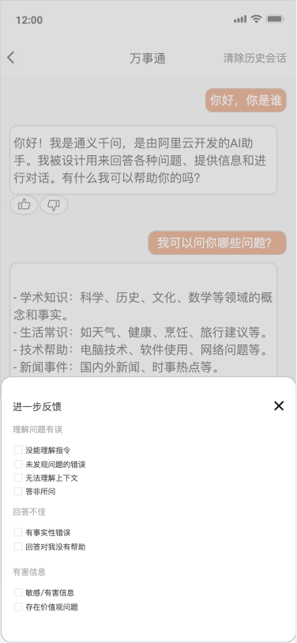
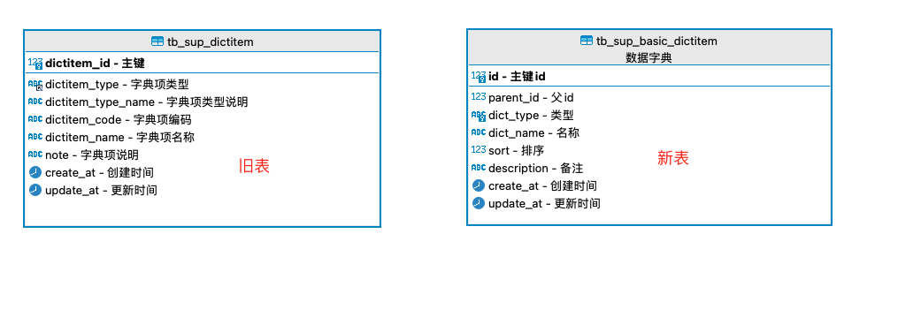
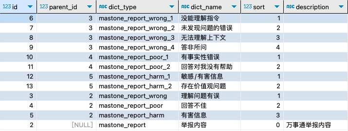

### 背景
最近接受一个小需求，对AI生成的对话记录提供点赞和反馈功能，反馈的内容由后端配置化

### 分析
看到需求第一时间想到的是将反馈内容存入数据字典表，经分析，系统目前的字典表设计最多只支持两级，虽然说勉强可以实现，可是会用到一些硬编码。刚好这段时间也不是很忙，做人还是得有一些追求，于是就有了这张树形结构的数据字典表，通用于多级数据字典，便于后续需求扩展。重点就是在原有的基础上加一个PID字段。

### 编码
##### 1.Dao实现
将入参字典类型匹配的字典项作为根节点，查找出根节点下的所有子孙节点，包含根节点本身，这里用到了自关联，因为我的mysql版本过低，不能用mysql自带的递归（WITH RECURSIVE 需要8.0及以上版本）
~~~mysql
SELECT
        d3.*
      FROM
        tb_sup_basic_dictitem d1
          JOIN
        tb_sup_basic_dictitem d2 ON d1.id = d2.parent_id
          JOIN
        tb_sup_basic_dictitem d3 ON d2.id = d3.parent_id
      WHERE
        d1.dict_type = 'mastone_report'
      UNION
      SELECT
        d2.*
      FROM
        tb_sup_basic_dictitem d1
          JOIN
        tb_sup_basic_dictitem d2 ON d1.id = d2.parent_id
      WHERE
        d1.dict_type = 'mastone_report'
      UNION
      SELECT
        d1.*
      FROM
        tb_sup_basic_dictitem d1
      WHERE
        d1.dict_type = 'mastone_report'
~~~

##### 2.service实现
将以上查询的结果集转成树形结构，也用到了递归
~~~java
public List<BasicDictitem> getByDictType(String dictType,boolean containSelf) {

        // 1.查找出根dictType相关的所有字典项
        List<BasicDictitem> itemList = basicDictitemMapper.findByDictType(dictType);

        // 2.将itemList转换成id,dictitem的map
        Map<Long, BasicDictitem> dictitemMap = itemList.stream()
                .collect(Collectors.toMap(BasicDictitem::getId, item -> item));

        // 3.将itemList转换成Map<Long,List<BasicDictitem>>，其中List<BasicDictitem>是按每个item对象中的parentId分组后的集合
        Map<Long, List<BasicDictitem>> childrenMap = itemList.stream().filter(item -> item.getParentId() != null)
                .collect(Collectors.groupingBy(BasicDictitem::getParentId));

        // 4.找到根节点，并从根节点开始遍历，构建子孙节点
        List<BasicDictitem> tree = new ArrayList<>();
        for (BasicDictitem item : itemList) {
            if (item.getParentId() == null) {
                buildTreeRecursive(item, childrenMap);
                tree.add(item);
            }
        }

        // 6.如果需要包含自身，则添加到树中,默认不包含
        if (containSelf){
            return tree;
        }

        return tree.get(0).getChildren();
    }

    /**
     * 递归构建子孙节点
     * @param parent
     * @param childrenMap
     */
    private void buildTreeRecursive(BasicDictitem parent, Map<Long, List<BasicDictitem>> childrenMap) {
        List<BasicDictitem> children = childrenMap.get(parent.getId());
        if (children != null) {
            for (BasicDictitem child : children) {
                buildTreeRecursive(child, childrenMap);
                parent.getChildren().add(child);
            }
        }
    }
~~~
### 3.controller实现
~~~java
    /**
     * 树形字典项通用接口，字典类型见tb_sup_basic_dictitem表
     * @param dictType 字典类型
     * @param containSelf 是否包含本身节点
     * @return
     */
    @GetMapping("/getByDictType.json")
    public YlskResult getByDictType(@RequestParam String dictType,
                                    @RequestParam(value = "containSelf",required=false,defaultValue = "0")boolean containSelf){
        List<BasicDictitem> tree = basicDictitemService.getByDictType(dictType,containSelf);
        return YlskResult.newSuccess(tree);
    }
~~~
~~~json
{
    "success": true,
    "code": 1,
    "data": [
        {
            "id": 3,
            "parentId": 2,
            "dictType": "mastone_report_wrong",
            "dictName": "理解问题有误",
            "children": [
                {
                    "id": 6,
                    "parentId": 3,
                    "dictType": "mastone_report_wrong_1",
                    "dictName": "没能理解指令",
                    "children": [

                    ]
                },
                {
                    "id": 7,
                    "parentId": 3,
                    "dictType": "mastone_report_wrong_2",
                    "dictName": "未发现问题的错误",
                    "children": [

                    ]
                },
                {
                    "id": 8,
                    "parentId": 3,
                    "dictType": "mastone_report_wrong_3",
                    "dictName": "无法理解上下文",
                    "children": [

                    ]
                },
                {
                    "id": 9,
                    "parentId": 3,
                    "dictType": "mastone_report_wrong_4",
                    "dictName": "答非所问",
                    "children": [

                    ]
                }
            ]
        },
        {
            "id": 4,
            "parentId": 2,
            "dictType": "mastone_report_poor",
            "dictName": "回答不佳",
            "children": [
                {
                    "id": 10,
                    "parentId": 4,
                    "dictType": "mastone_report_poor_1",
                    "dictName": "有事实性错误",
                    "children": [

                    ]
                },
                {
                    "id": 11,
                    "parentId": 4,
                    "dictType": "mastone_report_poor_2",
                    "dictName": "回答对我没有帮助",
                    "children": [

                    ]
                }
            ]
        },
        {
            "id": 5,
            "parentId": 2,
            "dictType": "mastone_report_harm",
            "dictName": "有害信息",
            "children": [
                {
                    "id": 12,
                    "parentId": 5,
                    "dictType": "mastone_report_harm_1",
                    "dictName": "敏感/有害信息",
                    "children": [

                    ]
                },
                {
                    "id": 13,
                    "parentId": 5,
                    "dictType": "mastone_report_harm_2",
                    "dictName": "存在价值观问题",
                    "children": [

                    ]
                }
            ]
        }
    ]
}
~~~

