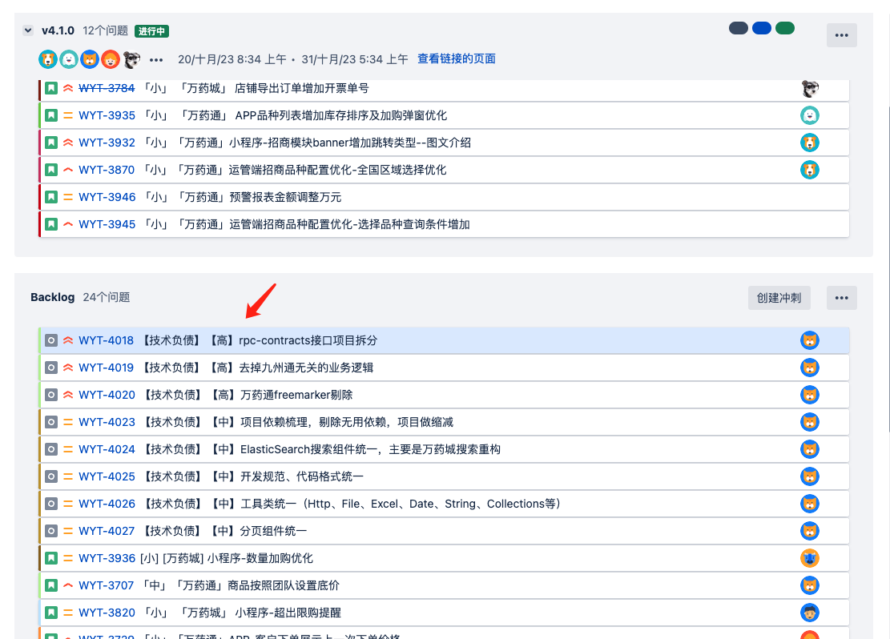

###  何为技术债务

技术债务：是指在软件开发过程中，为了快速交付产品或功能而采取的技术上的妥协或权衡。它类似于财务债务，是对未来付出代价的承诺。技术债务可以包括未完成的功能、低质量的代码、技术陈旧或过时、缺乏文档和测试覆盖等。这些债务会增加软件系统的复杂性、降低可维护性，并增加未来开发和维护的成本。与财务债务类似，技术债务也需要及时偿还，以确保软件系统的质量和可持续性。技术团队通常会努力减少技术债务，并在合适的时机进行技术债务的还清和重构。

### 技术债务如何偿还
技术债务的偿还是一个重要的过程，它有助于改善软件系统的质量和可维护性。以下是一些常见的技术债务偿还策略：

1. 重构代码：通过重构低质量的代码，改善其可读性、可维护性和性能。这包括使用最佳实践和设计模式来优化代码结构和逻辑。

2. 添加测试覆盖：为没有足够测试覆盖的代码编写单元测试、集成测试和端到端测试。这样可以更好地保证代码的正确性和稳定性。

3. 更新技术栈：评估和更新过时的技术和工具，以提高系统的性能、安全性和可维护性。这可能涉及到升级框架、库和依赖项，以及采用新的开发实践和工具。

4. 改进文档和注释：完善代码的文档和注释，使其更易于理解和维护。这有助于新的开发人员快速上手，并减少未来开发的困惑和错误。

5. 优化性能：识别并解决系统中的性能问题，包括减少响应时间、提高并发处理能力和优化资源利用率。

6. 追踪技术债务：建立技术债务的追踪和管理机制，以确保它们得到适时的关注和处理。这可以通过使用专门的工具或集成到项目管理工具中来实现。

需要注意的是，技术债务的偿还需要权衡时间、资源和优先级。团队应该根据项目的需求和优先级，制定合理的计划和策略来偿还技术债务，以最大程度地提高软件系统的质量和可持续性。

### 我在项目中如何管理技术债
1. 利用JIRA来记录技术债：
   * JIRA中新建任务类型：技术债务
   * （业务代码）业务小组通过在迭代过程中发现并记录到Jira backlog中
   * （基础组件）架构小组至少每个月主动去cod review一次以上，发现并记录到Jira backlog中
2. 分析并评估backlog中每个技术债的优先级和工时
3. 产品迭代过程中，评估下个版本业务需求范围时，适当地、合理地安排工期短、优先级高的技术债纳入版本范围，并全员宣讲，每日站会跟进
4. 对于中低优先级的技术债，以月或季为纬度，单独建立冲刺，临时成立研发+测试小组，利用空档时间来处理，每周周会跟进

