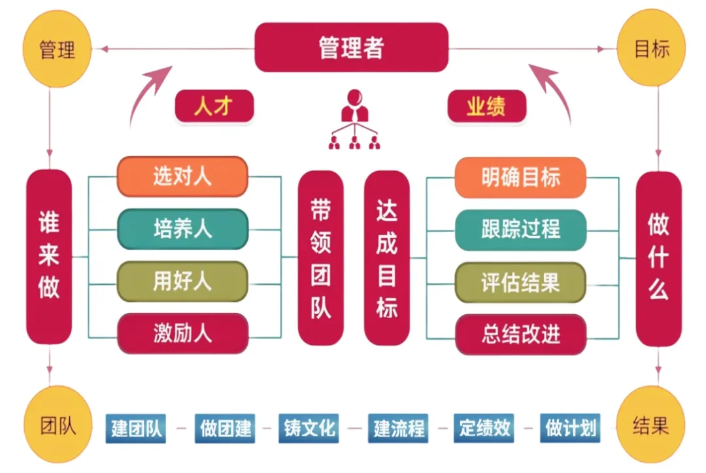
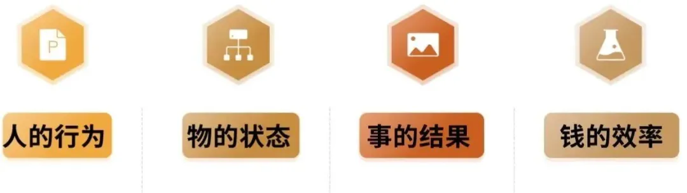
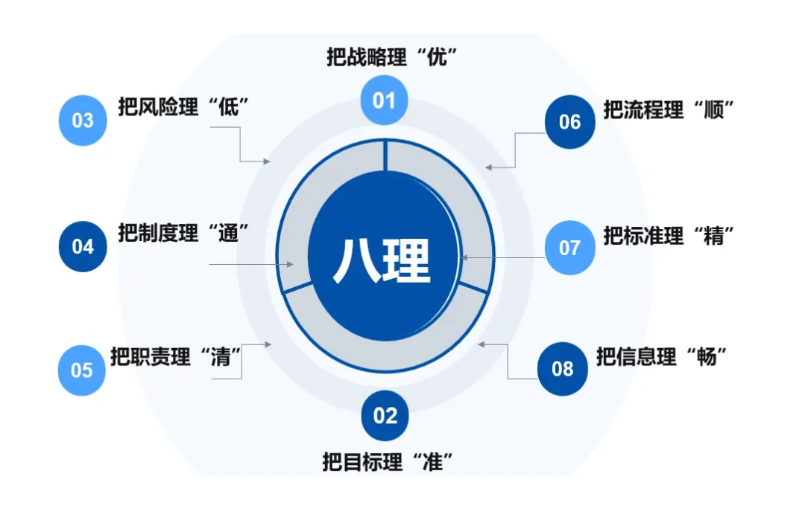
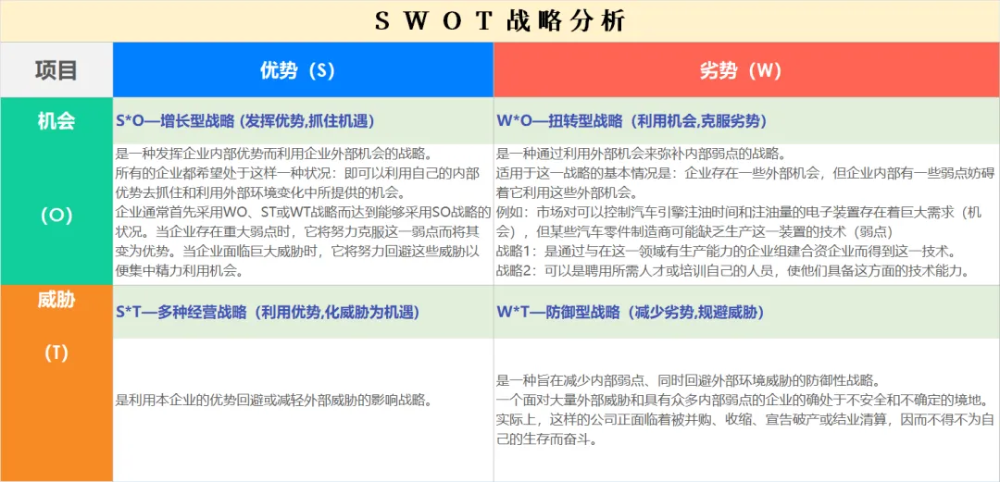
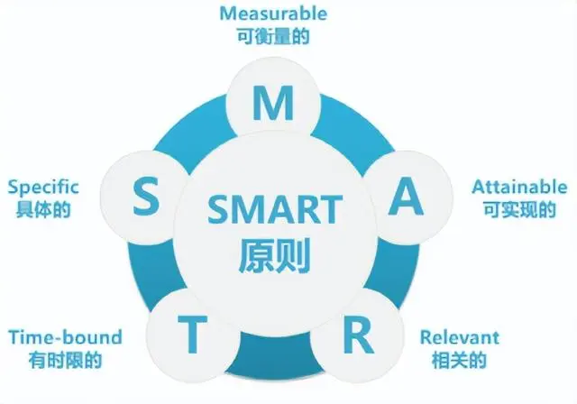

> [原文:https://mp.weixin.qq.com/s/_EM7gfmEzhPH0-dYngQAZg](https://mp.weixin.qq.com/s/_EM7gfmEzhPH0-dYngQAZg)

管理

这个词大家一点都不陌生，但是，到底什么是管理？管什么？理什么？却是众说纷纭，很多人认为，管理就是“管人”和“理事”，还有人说是“管事”和“理人”，这么理解固然无错，但个人认为，这很抽象和片面。我记得我第一次读到彼得德鲁克先生关于管理的理解的时候，那叫一种震撼，就像是被什么东西击中了一样，他说，管理的本质就是**“激发善意”**。“科学管理之父”泰罗认为：“管理就是确切地知道你要别人干什么，并使他用最好的方法去干”。那么，对于一个组织来说，到底是管什么？理什么呢？

---
01管理模型图
管理模型长什么样子的呢？管理模型是指企业为实现其经营目标的组织资源、生产经营活动的基本框架和方式。通俗来讲就是企业管理套路，有了这个套路，避免从头开始进行摸索，管理模型的作用就是抽象和概括管理的思想和框架，在这个思想和框架下建立一系列管理体系。

---

02 管理中的“四管

管理有四大基本职能，分别是计划、组织、领导和控制。它们是管理过程中不可或缺的要素。无论是企业组织、团队、机构还是其他组织形式，都需要应用这四大职能来实现组织目标、优化资源利用和协调各项工作。

**1.管住“人”的行为**
管理最核心的就是对人的管理。管人要管什么？——思想和行为。人的管理最终要落实在人的**思想和行为**上，思想决定行为，思路决定出路。人的思想和行为直接影响着工作质量和工作效率。行为受到意识、技能和标准的制约。所以，要通过岗位素质要求、标准化作业、技能培训、检查、指导、考核、激励和沟通等方式规范和约束人的行为。

**2.管住“物”的状态**
物的状态分三个方面，一是存在状态、二是防护状态、三是账目状态。国内当前很多企业不断推起精益成本理念的学习，其中一个重要原因就是想有效实施“物的状态”管理，从根本上消除各类浪费。我们应当应从建章立制、信息化建设、可视化监控、内部评审等方面加强物的管理。

**3.管住“事”的结果。**
企业管理过程中，最为常用的一就是PDCA闭环管理法，任何事情要遵循“计划、实施、检查、处置”的完整闭环。管住“事的结果”，常规来说，就是抓好执行力，做到**“五有五必有”**（有工作必有目标、有目标必有方案、有方案必有方计划、有计划必有检查、有检查必有结果）。在管理活动中，本着四不放过和PDCA原则的同时，善于运用先进的管理工具（如防呆改善、QC、A3、8D报告、审核评价）等方法做好“事”的管理。

**4.管住“钱”的效率**
钱的效率主要体现在两个方面，**一是钱要用在该用的地方**。需要用钱的地方得要评估评审，花掉多少不是问题，花得值不值才是关键，杜绝大手大脚造成不必要的浪费。**二是堵住钱的漏洞**。企业得有严格的审批流程及权限设置、从企业的预算管理、采购系统、物流系统等方面必须得有制约机制、内部审计、会计监督，加强“钱”的使用和监督管理。

---

03 管理过程中的“八理

一个组织或团队，面对“人、事、物、资、时、效”等管理要素，要理的东西特别多，各个环节错综复杂，那到底要理什么，作为管理者抓得住命脉，否则你就是累死也理不清楚，干不出成效。

**1.把战略理“优”。**
企业的战略定位和战略规划是企业方向和命脉，是企业持续、健康发展的关键。所以、我们应该从企业的战略使命和愿景出发，运用科学和系统的分析方法，如SWOT分析，对公司自身的竞争优势、劣势、机会和威胁进行分析，从而将公司的战略与公司的内部资源、外部环境有机结合起来。并形成公司的战略规划，对战略进行实施和控制。

**2.把目标理“准”。**

企业要战略愿景及规划，必须建立起内部科学、系统的目标管理体系。按照中长期和短期进行目标制定，从上而下层层分解，从下而上逐级支撑，把目标分解到最小单元，落实到每一个具体的作业层面。**目标管理的核心是“精”**——抓住关键的重点项。而不是“多”，目标太多，并不是好事，土话说“眉毛胡子一把抓”，反而把自己搞得手忙脚乱。这里给大家推荐目标管理的SMART原则。

**3.把风险理“低”。**
企业在经营过程中，会遇到来自内部和外部的各种风险，这些风险包括政策的变化、市场的波动、产品、财务及运营带来的风险。这些风险如果不及时识别和控制，会给企业带来不可估量的，甚至是灾难性损失。所以，应该按照相关标准要求，建立公司的风险防范机制。

**4.把制度理“通”。**
一个健康的企业要法制，不要人治，**制度是最好的领导**。制度管理远比人的管理要规范、有序和效率。但是，很多企业和管理者不善于建章立制，把工作要求和标准停留在口头上，时间久了，就会带来政令上朝令夕改、执行上大打折扣。其次，即使有制度，也是泛泛而谈，全是纲领性的文字，根本不能落地。所以，建章立制上应着力解决好管理制度的“合理、适用”问题。把制度建完整，把节点理通，这样才能“有法可依，有法必依”。

**5.把职责理“清”。**
任何工作都应遵循**“职责明确、目标清晰”**的八字原则，任何管理工作都应该把责任明确到个人头上，不要交叉负责，否则，大家管大家都不管。明确职责的同时要把目标量化，要有时限和可量化的数字标准，同时，职责要和管理制度、手册、程序有机结合。否则，带来的将是推诿扯皮。通常情况下，推诿扯皮的理由是：**不知道该谁干、不知道怎么干、不知道何时干、不知道干到什么程度。**

**6.把流程理“顺”。**
流程一定要跟“权”和“责”结合起来，并和时间目标和绩效考核挂钩，这样才能提高流程效率。很多企业机构设置臃肿、流程与业务不匹配办事拖拉、环节过多审批繁琐、流程不透明，无法监督而效率低下。所以，应通过分级流程图明确责任，必要时可以结合办公自动化系统提高流程速度。

**7.把标准理“精”。**
作业标准**“模板化”**是指导员工规范、高效作业的依据，是是员工技能快速均衡较好的方法。生产和管理过程中产生的各种浪费、工作效率低下等问题，与企业缺乏可操作性的作业标准有很大的关系。应按照标准化、精细化、目视化管理的要求，建立简洁、明了、可操作的作业标准。

**8.把信息理“畅”。**
企业管理过程有三个流：**人流、物流和信息流**。其中，信息流对数据分析、问题发现、正确决策、过程控制、绩效考核、持续改进起着至关重要的作用。我们应该明确信息需求、信息传递方式及传递渠道，让各级决策者能及时了解有关生产和经营信息。如果有条件，可以通过Mes、ERP等信息系统进行信息流的管理。
